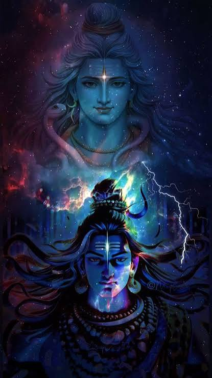
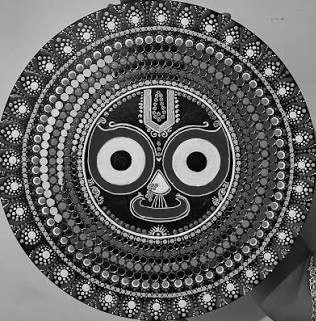
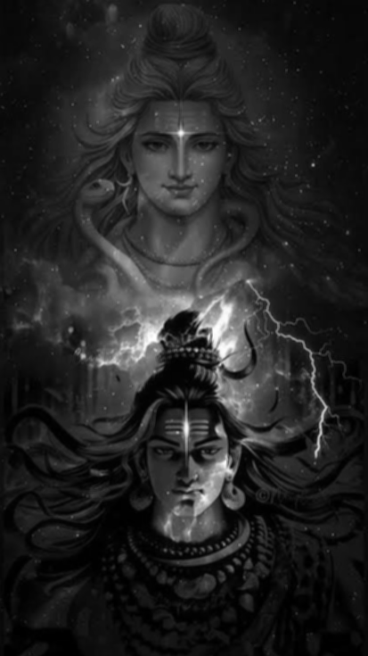
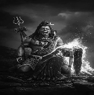

# NumPy Image Transforms

Grayscale conversion, box blur, and nearest-neighbor resize on a photo, written with NumPy only. No PIL or OpenCV for the transforms, and no Python `for`/`while` loops in the transform code.

## Results

| Original                         | Grayscale                          | Blurred                        | Resized                        |
| -------------------------------- | ---------------------------------- | ------------------------------ | ------------------------------ |
|  |  |  |  |

## What it does

- **Grayscale:** converts an RGB image to a single-channel brightness image using the standard luminosity weights.
- **Box blur:** replaces each pixel with the average of its 3×3 neighborhood, which softens edges.
- **Resize:** scales an image to any new height and width using nearest-neighbor sampling.

## How to run

```bash
git clone https://github.com/shubhigoyal37/numpy-image-transforms.git
cd numpy-image-transforms
python3 -m venv venv
source venv/bin/activate        # Windows: venv\Scripts\activate
pip install -r requirements.txt
python main.py
```

`main.py` reads `images/original.jpg` and writes `grayscale.png`, `blurred.png`, and `resized.png` to `images/`.

To use the transforms on their own:

```python
import matplotlib.image as mpimg
from transforms import grayscale, box_blur, resize

img = mpimg.imread("images/original.jpg")
gray = grayscale(img)            # (H, W, 3) -> (H, W)
blurred = box_blur(gray)         # (H, W)    -> (H-2, W-2)
small = resize(gray, 160, 158)   # (H, W)    -> (160, 158)
```

## How it works

An image is a NumPy array of shape `(height, width, 3)`, holding red, green, and blue values from 0 to 255 for every pixel. Each transform operates on the whole array at once instead of visiting pixels one at a time.

**Grayscale.** `img[:, :, 0]`, `img[:, :, 1]`, and `img[:, :, 2]` each pull out one full `(H, W)` grid: every pixel's red, green, or blue value. The weighted sum `0.2989*R + 0.5870*G + 0.1140*B` is then computed on all pixels in a single expression. Green gets the largest weight because the eye is most sensitive to it. The result is float, so it is cast back to `uint8` before saving.

**Box blur.** `numpy.lib.stride_tricks.sliding_window_view(gray, (3, 3))` returns every 3×3 neighborhood as a view of shape `(H-2, W-2, 3, 3)`, with no copying and no loop. Taking `.mean(axis=(2, 3))` averages away the two window axes and leaves one value per window position.

**Resize.** For each output row, the source row is `i * old_h // new_h`, and the same idea applies to columns. Both mappings are computed as index arrays with `np.arange(new) * old // new`. Then `img[row_idx][:, col_idx]` selects the rows first and the columns second, which produces the full resized grid. Enlarging repeats source pixels, and shrinking skips some.

## Complexity

Let `N` be the number of pixels. Grayscale, box blur (fixed 3×3 window), and resize are each O(N) in time and O(N) in space, since each one produces a new array proportional to its output size.

## Notes and limitations

- The blurred image is 2 pixels smaller in each direction, because a 3×3 window cannot be centered on a border pixel.
- Nearest-neighbor resizing is fast but produces blocky edges when enlarging.
- Blur is applied to the grayscale image. Running it on each color channel separately would be a straightforward extension.
- `matplotlib` is used only to read and write image files. All transforms use NumPy alone.

## Project structure

```
numpy-image-transforms/
├── README.md
├── requirements.txt
├── transforms.py      # grayscale(), box_blur(), resize()
├── main.py            # loads the photo, runs all transforms, saves outputs
├── images/
│   ├── original.jpg
│   ├── grayscale.png
│   ├── blurred.png
│   └── resized.png
└── .gitignore
```
